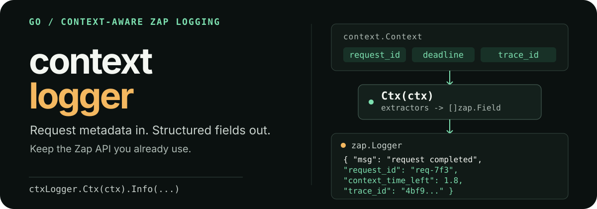

<p align="center">
  <picture>
    <source media="(max-width: 600px)" srcset="./assets/readme/hero-mobile.svg">
    
  </picture>
</p>

<p align="center">
  <a href="https://pkg.go.dev/github.com/adlandh/context-logger"></a>
  <a href="https://github.com/adlandh/context-logger/actions/workflows/test.yml"></a>
  <a href="https://goreportcard.com/report/github.com/adlandh/context-logger"></a>
</p>

# Context Logger

`context-logger` enriches [Zap](https://pkg.go.dev/go.uber.org/zap) entries with request-scoped values from `context.Context`. Register explicit extractors once, then keep using the normal `*zap.Logger` API.

## Start here

Requires Go 1.25.

```bash
go get github.com/adlandh/context-logger
```

```go
package main

import (
	"context"

	ctxlog "github.com/adlandh/context-logger"
	"go.uber.org/zap"
)

type contextKey string

func (k contextKey) String() string { return string(k) }

const requestIDKey = contextKey("request_id")

func main() {
	logger, _ := zap.NewProduction()
	ctxLogger := ctxlog.New(logger, ctxlog.WithValueExtractor(requestIDKey))

	ctx := context.WithValue(context.Background(), requestIDKey, "req-7f3")
	ctxLogger.Ctx(ctx).Info("request completed", zap.Int("status", 200))
}
```

Relevant fields in the resulting entry:

```json
{"msg":"request completed","request_id":"req-7f3","status":200}
```

Use package-local typed keys instead of strings to prevent collisions. Keys passed to `WithValueExtractor` must be comparable and implement `fmt.Stringer`; their string value becomes the Zap field name.

## Compose extractors

Every extractor is a `func(context.Context) []zap.Field`. Combine value, deadline, tracing, and custom extractors at construction time:

```go
ctxLogger := ctxlog.WithContext(
	logger,
	ctxlog.WithValueExtractor(requestIDKey, userIDKey),
	ctxlog.WithDeadlineExtractor(),
	otelextractor.With(),
)

ctxLogger.Ctx(ctx).Info("request handled")
```

`Ctx(ctx)` applies the configured extractors and returns a `*zap.Logger` with their fields attached. Extractors that have nothing to add return `nil`.

## Built-in extractors

- **`WithValueExtractor(keys...)`** adds non-nil context values with `zap.Any`.
- **`WithDeadlineExtractor()`** adds `context_deadline_at` and `context_time_left` when a deadline exists. It also adds `context_error` after cancellation or deadline expiry, and `context_cause` when the context was canceled with a distinct cause (see `context.WithCancelCause`).
- **`WithContextCarrier(fieldName)`** passes the raw context to a custom Zap core or encoder. It uses `zapcore.SkipType`, so standard encoders do not emit it.

## Trace correlation

OpenTelemetry and Sentry integrations live in separate Go modules, so applications only install the tracing SDK they use.

```bash
go get github.com/adlandh/context-logger/otel-extractor
go get github.com/adlandh/context-logger/sentry-extractor
```

```go
import (
	otelextractor "github.com/adlandh/context-logger/otel-extractor"
	sentryextractor "github.com/adlandh/context-logger/sentry-extractor"
)

otelLogger := ctxlog.New(logger, otelextractor.With())
sentryLogger := ctxlog.New(logger, sentryextractor.With())
```

- OpenTelemetry adds `trace_id` and `span_id` for valid span contexts.
- Sentry adds `trace_id`, `span_id`, `span_status`, and `span_op` when a span is present.

## Custom extractors

Keep extractors cheap and side-effect free because they run on every `Ctx` call.

```go
func WithTenant() ctxlog.ContextExtractor {
	return func(ctx context.Context) []zap.Field {
		tenant, ok := ctx.Value(tenantKey).(string)
		if !ok || tenant == "" {
			return nil
		}

		return []zap.Field{zap.String("tenant_id", tenant)}
	}
}
```

## Behavior

- `New` and `WithContext` are equivalent constructors.
- A nil underlying logger falls back to `zap.NewNop()`.
- `Ctx(nil)` uses `context.Background()`.
- `With(extractors...)` returns a new `ContextLogger` without modifying the original.
- `Logger()` returns the underlying `*zap.Logger`.

See the complete API on [pkg.go.dev](https://pkg.go.dev/github.com/adlandh/context-logger) and the [Echo request-ID example](./example/main.go) for HTTP integration.

## Development

Each extractor is a separate module and test target:

```bash
go test -cover -race ./...
(cd otel-extractor && go test -cover -race ./...)
(cd sentry-extractor && go test -cover -race ./...)
```

## License

[MIT](./LICENSE)
